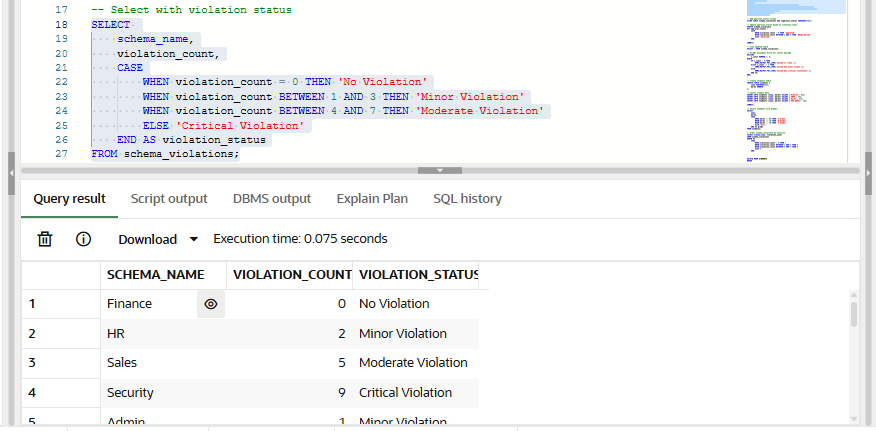
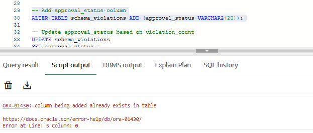
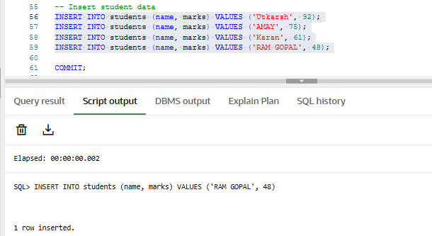
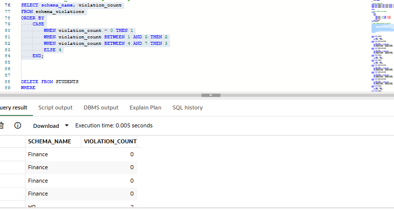

# Experiment 4 – Data Analysis Using SQL and PL/SQL

## Experiment
**Experiment 4:** Creating tables, inserting data, executing conditional queries, and using PL/SQL blocks to analyze schema violations and student grades. This experiment demonstrates table creation, data manipulation, conditional logic, and ordering using Oracle SQL and PL/SQL.

## Aim
To practice working with Oracle SQL tables, apply conditional logic to determine schema status and student grades, and display results using SELECT queries and PL/SQL blocks.

## Objectives
- To create and populate tables in Oracle SQL  
- To use CASE statements for conditional evaluation of violation counts and student grades  
- To add and update table columns based on conditions  
- To use PL/SQL anonymous blocks for displaying status messages  
- To sort query results using defined criteria  

## Software Requirements
- **Database:** Oracle XE or Oracle Live SQL  

## Practical / Experiment Steps
1. Create a table named `schema_violations` with columns `id`, `schema_name`, and `violation_count`.  
2. Insert sample data for various departments into the `schema_violations` table.  
3. Display the violation status for each department using a CASE statement.  
4. Add a new column `approval_status` to the `schema_violations` table.  
5. Update `approval_status` based on `violation_count` using a CASE statement.  
6. Display the updated `schema_violations` table.  
7. Execute a PL/SQL anonymous block to print a system status message based on a variable `v_count`.  
8. Create a `students` table with columns `name` and `marks`.  
9. Insert student records into the `students` table.  
10. Display student grades using a CASE statement based on marks obtained.  
11. Order `schema_violations` records by severity using a CASE statement in the `ORDER BY` clause.  

## Procedure
1. Open Oracle XE or Oracle Live SQL and connect to the database.  
2. Create the `schema_violations` and `students` tables.  
3. Insert sample data into both tables.  
4. Execute SELECT queries using CASE statements to analyze violation status and student grades.  
5. Alter and update tables using conditional logic.  
6. Write and execute a PL/SQL anonymous block to display dynamic status messages.  
7. Sort and retrieve records based on defined severity levels.  
8. Observe the outputs at each step and capture screenshots for documentation.  

## Input / Output Details

### Input
- `schema_violations` table: `id`, `schema_name`, `violation_count`  
- `students` table: `name`, `marks`  
- PL/SQL variable: `v_count`  
- Conditional logic using CASE statements in SELECT and UPDATE queries  

### Step-wise Output

**Step 1 – Create `schema_violations` Table**  
Table created successfully.

**Step 2 – Insert Data into `schema_violations`**  
Rows inserted successfully.

**Step 3 – Display Violation Status of Each Department**  

**Step 4 – Add `approval_status` Column**  

**Step 5 – Update `approval_status` Based on Violation Count**  

**Step 6 – Display Updated `schema_violations` Table**  

**Step 7 – PL/SQL Block Output (System Status Message)**  

**Step 8 – Create `students` Table**  
Table created successfully.

**Step 9 – Insert Data into `students` Table**  

**Step 10 – Display Student Grades**  

**Step 11 – Order `schema_violations` by Severity**  

